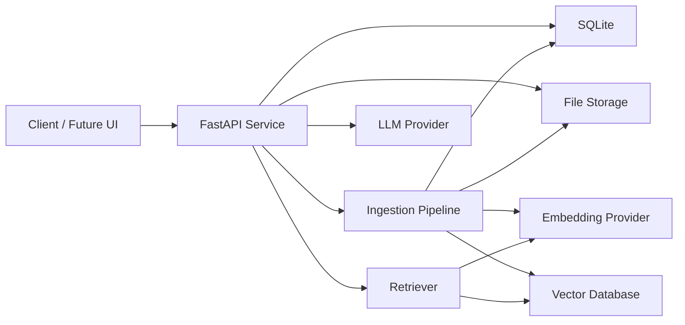

# 系统架构

## 架构概览



## 服务模块

### API 层

负责 HTTP 请求、参数校验、响应结构和错误处理。

建议模块：

- `app/api/documents.py`
- `app/api/query.py`
- `app/api/health.py`

### 核心配置

负责读取环境变量、初始化日志、配置 provider。

建议模块：

- `app/core/config.py`
- `app/core/logging.py`

### 数据库层

负责 SQLite 表结构和 CRUD。后续需要多人或服务器部署时，可切换 PostgreSQL。

核心实体：

- Document
- Chunk
- IngestionJob
- QueryLog

### 文档处理层

负责文件解析、文本清洗、chunk 切分和任务编排。

建议模块：

- `app/ingest/loaders.py`
- `app/ingest/splitter.py`
- `app/ingest/pipeline.py`

### RAG 层

负责 embedding、检索、prompt 组装和模型调用。

建议模块：

- `app/rag/embeddings.py`
- `app/rag/vector_store.py`
- `app/rag/retriever.py`
- `app/rag/prompts.py`
- `app/rag/generator.py`

### 任务处理

MVP 阶段优先功能可用，上传后可以同步执行解析、切分和向量化。后续文档较大或需要批量处理时，再引入异步 worker。

## Provider 抽象

Embedding 和 LLM 都应以接口形式封装，业务代码只依赖抽象。

```python
class EmbeddingProvider:
    async def embed_texts(self, texts: list[str]) -> list[list[float]]:
        ...

class LLMProvider:
    async def generate(self, messages: list[dict], temperature: float = 0.2) -> str:
        ...
```

这样后续切换本地 Ollama、云端模型或 OpenAI-compatible 网关时，主要改 provider 实现和环境变量。

## 数据边界

- 原始文件保存在本地 file storage。
- 文档元数据保存在 SQLite。
- chunk 文本和引用信息保存在 SQLite。
- chunk 向量保存在向量数据库。
- 问答日志保存在 SQLite。
