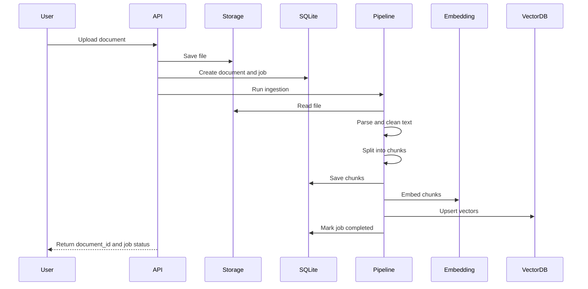
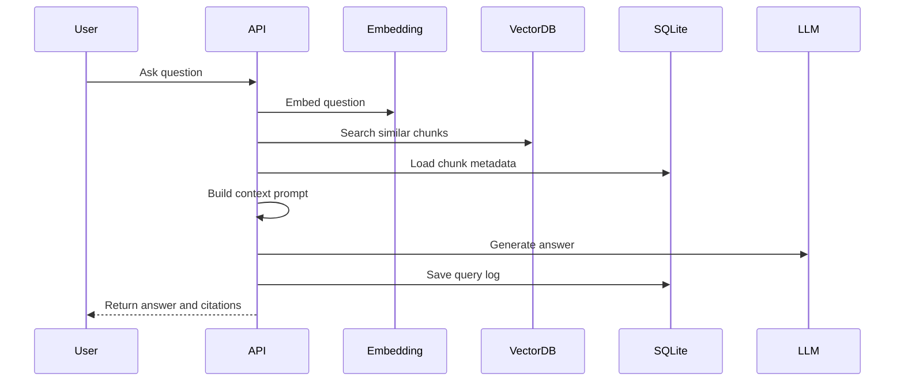

# 数据流程

## 文档入库流程



## 问答流程



## Chunk 设计

建议默认值：

- `chunk_size`: 800 到 1200 中文字符，或对应 token 长度
- `chunk_overlap`: 100 到 200 中文字符
- `top_k`: 5
- `score_threshold`: 按向量库实际分数标定

每个 chunk 至少保存：

- `id`
- `document_id`
- `content`
- `chunk_index`
- `page_number`
- `source_name`
- `metadata`

## 引用策略

回答返回 citations：

```json
[
  {
    "document_id": "doc_123",
    "chunk_id": "chunk_456",
    "source_name": "example.pdf",
    "page_number": 3,
    "score": 0.82,
    "text": "引用片段摘要"
  }
]
```

前端或调用方可以据此展示来源。
